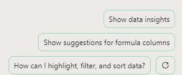

# Analizar una hoja de cálculo de tendencias de mercado con Copilot en Excel
---
Los profesionales de marketing pueden usar Copilot en Excel para analizar sus datos y obtener información sobre su negocio. Copilot en Excel es una herramienta eficaz que puede ayudar a los profesionales de marketing a crear, editar, comprender y visualizar sus datos con facilidad.

Por ejemplo, pueden usar Copilot en Excel para analizar los resultados empresariales trimestrales, resumir tendencias clave, aplicar codificación de colores a tablas, crear modelos, escenarios, filtrar y ordenar y agregar gráficos con un clic de mouse. Las funcionalidades con la tecnología de inteligencia artificial de Copilot pueden ayudar a los profesionales de marketing a ahorrar tiempo y esfuerzo al automatizar tareas repetitivas y proporcionar información valiosa que puede ayudarles a tomar decisiones fundamentadas. Al usar Copilot en Excel, pueden centrarse en lo que más importa: sus metas y objetivos empresariales.

Copilot en Excel es una herramienta muy valiosa entre las herramientas a disposición del profesional de marketing. Proporciona una gran cantidad de ventajas, entre las que se incluyen las siguientes:

 -  **Resaltar, filtrar y ordenar datos sin esfuerzo**: Copilot en Excel puede resaltar, filtrar y ordenar los datos para ayudar a los profesionales de marketing a identificarlos y organizarlos rápidamente. Por ejemplo, un profesional de marketing puede usar Copilot para filtrar los datos irrelevantes de un conjunto de datos grande, como datos demográficos de clientes, y centrarse en los datos más relevantes para sus objetivos de marketing.
 -  **Generar sugerencias de columna de fórmula para los cálculos complejos**: Copilot en Excel puede ayudar a los profesionales de marketing a generar sugerencias de columna de fórmula para los cálculos complejos, como calcular la rentabilidad de la inversión (ROI) de sus campañas de marketing. Por ejemplo, un profesional de marketing puede usar Copilot para calcular la rentabilidad de la inversión de su campaña de marketing por correo electrónico al dividir los ingresos generados por la campaña por el coste de la campaña.
 -  **Ayudar a analizar, comprender y visualizar datos**: Copilot en Excel puede ayudar a los profesionales de marketing a analizar, comprender y visualizar sus datos mediante la eficacia de la inteligencia artificial. Por ejemplo, un profesional de marketing puede usar Copilot para identificar tendencias en sus datos de ventas y usar esta información para tomar decisiones fundamentadas sobre sus estrategias de marketing.

Al usar Copilot en Excel, debe tener una tabla de Excel que incluya datos en una hoja de cálculo. Puede convertir rápidamente un rango de celdas en una tabla de Excel siguiendo estos pasos:

1.  Seleccione la celda o el rango en los datos.
2.  Seleccione **Inicio** &gt; **Dar formato como tabla**.
3.  En el cuadro de diálogo **Dar formato como tabla**, active la casilla junto a **Mi tabla tiene encabezados** si desea que la primera fila del rango sea la fila de encabezado.
4.  Seleccione **Aceptar**.

En este ejercicio, usará Copilot en Excel para analizar una hoja de cálculo de tendencias de mercado que ya tiene definida una tabla de Excel. En este ejercicio, se examinan muchas de las funciones e indicaciones precompiladas de Copilot. 

### Ejercicio

Como director de marketing de Contoso Beverage (una división de Contoso, Ltd.), recibió una hoja de cálculo de tendencias de mercado que muestra la actividad mensual del producto de té Chai de Contoso en 2023. Quiere usar las características de Copilot en Excel para analizar el informe y proporcionar un análisis detallado de las tendencias de marketing mensuales en 2023. En este ejercicio, revisará las diversas indicaciones y características predefinidas que Copilot en Excel proporciona.

Realice los pasos siguientes para analizar la hoja de cálculo de tendencias de mercado mediante Copilot en Excel:

1.  Si descargó la hoja de cálculo [Tendencias de mercado del té Chai de Contoso en 2023](https://go.microsoft.com/fwlink/?linkid=2268822) en el ejercicio anterior, continúe con el siguiente paso. Si no lo hizo, seleccione el vínculo para descargar el archivo, muévalo a su cuenta de OneDrive y, a continuación, abra y cierre el archivo para que se incluya en la lista de archivos usados más recientemente (MRU).
2.  Si tiene una pestaña de Microsoft 365 abierta en su explorador de Microsoft Edge, selecciónela ahora; de lo contrario, abra una nueva pestaña y escriba la siguiente URL: **https://www.office.com**
3.  En la página principal de **Microsoft 365**, seleccione el icono de **Excel** en el panel de navegación de la izquierda.
4.  En **Excel**, en la página **Archivo**, seleccione **Tendencias de mercado del té Chai de Contoso en 2023.xlsx** en la lista de archivos.
5.  Seleccione la opción **Copilot** en la parte derecha de la cinta.
6.  En el panel de **Copilot** que aparece, tiene a su disposición varias indicaciones predefinidas entre las que puede elegir. Seleccione el botón **Mostrar información de los datos**.
    
  
    
7.  Observe el gráfico dinámico que se ha generado. Cuando probamos este ejercicio, Copilot siempre creó un gráfico de líneas de la **Interacción en redes sociales (vistas) por fecha**. ¿Qué tipo de gráfico ha creado Copilot para usted? Debajo del gráfico que Copilot ha creado para usted, seleccione el botón **+Agregar a una hoja nueva**.
8.  Seleccione **Hoja 2**. Revise la nueva hoja de datos que ha creado Copilot. Copilot incluyó tanto el gráfico como la columna de datos de la hoja de cálculo que era la base de este gráfico. Coloque el cursor sobre el gráfico y observe la ventana que aparece, que indica el tipo de gráfico generado por Copilot.
9.  Observe que en el panel de Copilot ya no aparece la lista de indicaciones predefinidas. Esto sucede porque Copilot aún no funciona en tablas dinámicas (observe el mensaje que indica este problema). Seleccione **Hoja 1**, que le devuelve a la tabla de Excel. Observe cómo aparecen las indicaciones predefinidas.
10. En las indicaciones predefinidas que aparecen sobre el campo de indicaciones, seleccione el botón **Mostrar sugerencias para las columnas de fórmulas**.
11. Observe la sugerencia que proporciona Copilot. En la imagen siguiente se muestra la sugerencia que Copilot proporcionó durante nuestras pruebas.
    
   
    
12. En la sugerencia que recibió, seleccione la flecha desplegable **Explicar la fórmula**. Revise la explicación de Copilot que describe el cálculo. Seleccione el botón **+Insertar columna** para insertar esta columna en la tabla de Excel.
13. Observe que Copilot agregó esta columna de datos al final de la tabla de Excel en **Hoja 1**. Esta característica le ha intrigado, por lo que ahora quiere ver qué otras sugerencias de fórmula proporciona. Seleccione de nuevo el botón **Mostrar sugerencias para las columnas de fórmula**. Observe la sugerencia. Seleccione el botón **+Insertar columna** para insertar esta columna sugerida en la tabla de Excel.
14. En las indicaciones predefinidas que aparecen sobre el campo de indicaciones, seleccione el botón **¿Cómo puedo resaltar, filtrar y ordenar los datos?**.
15. Observe la lista de acciones que puede realizar.
16. Revise la lista revisada de indicaciones predefinidas que aparecen ahora. En la imagen siguiente, se muestran ejemplos de indicaciones recibidas en nuestras pruebas.
    
   
    
17. El propósito de este ejercicio es hacerse una idea de los distintos tipos de acciones predefinidas que Copilot puede realizar. Por lo tanto, seleccione diferentes indicaciones para ver lo que sucede. Por ejemplo:
     -  Si aparece una indicación de **Ordenar**, selecciónela ahora. Observe que Copilot ha ordenado los datos automáticamente.
     -  Si aparece una indicación de **Poner en negrita**, selecciónela ahora. Observe que Copilot ha puesto en negrita los elementos de la columna que mencionó, pero no los demás.
     -  Si aparece una indicación de **Resaltado**, selecciónela ahora. Observe la respuesta de Copilot y cómo ha resaltado los datos de la tabla.
18. En este momento, las indicaciones predefinidas que Copilot muestra ya no le interesan. Por lo tanto, quiere ver un nuevo conjunto de indicaciones. Seleccione el botón **Actualizar** que aparece sobre el campo de indicaciones.
    
   
    
    
19. Revise el nuevo conjunto de indicaciones que se muestra. Seleccione el botón **Actualizar** varias veces para ver los distintos tipos de indicaciones que Copilot proporciona.
20. No dude en seleccionar cualquier otra indicación para ver lo que hace Copilot. Cuando haya terminado, cierre la pestaña del explorador Microsoft Edge.
